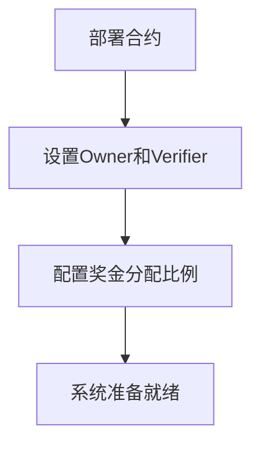
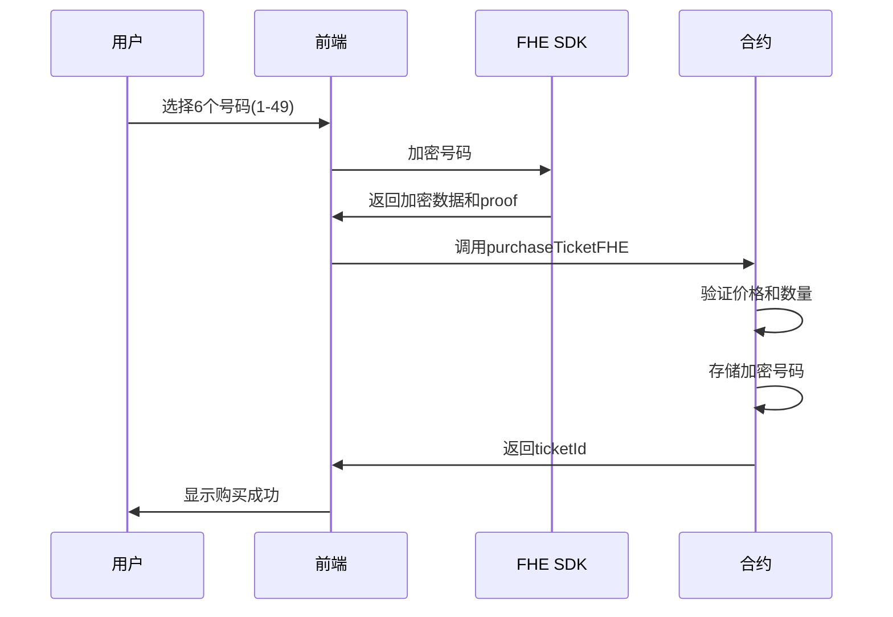
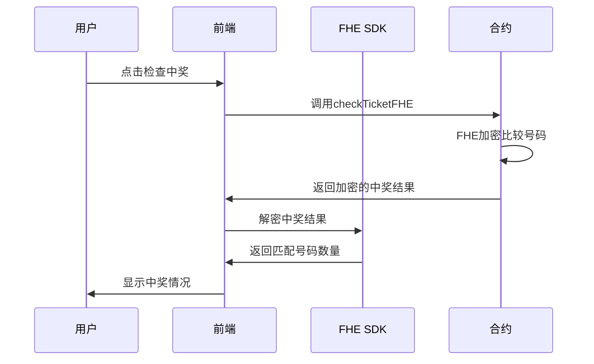

# 🎲 Secret Spin Vault - 完整业务流程梳理

## 📋 系统概述

**Secret Spin Vault** 是一个基于FHE（完全同态加密）技术的隐私保护彩票系统，确保用户的彩票号码在整个过程中保持加密状态。

## 🏗️ 系统架构

### 核心组件
- **智能合约**: `SecretSpinVaultFHE.sol` - 处理FHE加密的彩票逻辑
- **前端应用**: React + TypeScript + Wagmi + RainbowKit
- **FHE SDK**: `@zama-fhe/relayer-sdk` - 客户端加密/解密
- **网络**: Ethereum Sepolia 测试网

### 关键角色
- **Owner**: 合约所有者，可以创建开奖
- **Verifier**: 验证者，负责开奖和验证
- **Players**: 玩家，购买彩票的用户

## 🎯 完整业务流程

### 1. 系统初始化阶段



**奖金分配比例**:
- 一等奖 (6个号码匹配): 50%
- 二等奖 (5个号码匹配): 25%
- 三等奖 (4个号码匹配): 15%
- 四等奖 (3个号码匹配): 10%

### 2. 彩票购买流程



**购买条件**:
- 彩票价格: 0.005 ETH
- 号码数量: 必须6个
- 号码范围: 1-49
- 号码唯一性: 不能重复

### 3. 开奖管理流程

#### 3.1 创建开奖 (Owner权限)

```solidity
function createDraw(uint256 _drawTime, uint256 _endTime) public
```

**参数说明**:
- `_drawTime`: 开奖时间 (必须大于当前时间)
- `_endTime`: 结束时间 (必须大于开奖时间)

**开奖频率建议**:
- **每日开奖**: 适合高频用户
- **每周开奖**: 适合普通用户
- **每月开奖**: 适合大奖池

#### 3.2 执行开奖 (Verifier权限)

```solidity
function conductDrawFHE(
    uint256 drawId,
    externalEuint32[] calldata encryptedWinningNumbers,
    bytes calldata inputProof
) public
```

**开奖流程**:
1. Verifier生成6个随机号码
2. 使用FHE SDK加密中奖号码
3. 调用合约函数存储加密的中奖号码
4. 系统自动标记开奖完成

#### 3.3 验证开奖 (Verifier权限)

```solidity
function verifyDraw(uint256 drawId, bool isVerified) public
```

### 4. 中奖检查流程



**中奖等级**:
- 6个号码匹配: 一等奖
- 5个号码匹配: 二等奖
- 4个号码匹配: 三等奖
- 3个号码匹配: 四等奖

### 5. 奖金领取流程

```solidity
function claimPrizeFHE(uint256 ticketId, uint256 drawId) public
```

**领取条件**:
- 必须是彩票所有者
- 开奖必须已完成
- 彩票必须中奖
- 奖金必须未领取

## ⏰ 开奖时间管理

### 建议的开奖频率

| 频率 | 适用场景 | 优势 | 劣势 |
|------|----------|------|------|
| **每周开奖** | 标准用户 | 平衡用户体验和管理成本，固定时间 | 等待时间适中，便于用户规划 |

### 开奖时间配置

**固定每周开奖**:
- **开奖时间**: 每周日晚上8:00 PM
- **开奖频率**: 固定每周一次
- **用户友好**: 用户可以提前规划购买时间
- **管理简单**: 固定的开奖时间便于管理

## 🔒 隐私保护机制

### FHE加密流程
1. **客户端加密**: 用户号码在浏览器中加密
2. **链上存储**: 加密数据存储在区块链上
3. **加密计算**: 在加密状态下进行中奖比较
4. **客户端解密**: 只有用户本人可以解密结果

### 数据隐私保证
- ✅ 彩票号码在开奖前完全保密
- ✅ 中奖号码在验证前完全保密
- ✅ 只有用户本人可以查看自己的号码
- ✅ 系统无法提前知道中奖结果

## 📊 实时数据展示

### 前端数据来源
- **奖池金额**: 从合约计算 (ticketPrice × totalTickets)
- **已售彩票**: 从合约读取 (ticketCounter)
- **当前开奖**: 从合约读取 (drawCounter)
- **彩票价格**: 从合约读取 (TICKET_PRICE)

### 数据更新机制
- 实时监听合约事件
- 自动刷新数据
- 显示加载状态
- 错误处理机制

## 🚀 部署和配置

### 合约部署信息
- **地址**: `0x54aeef31B1E388Aadb2c1fF0888e1d6aD2897E2e`
- **网络**: Ethereum Sepolia
- **部署者**: blocktrace1986

### 环境配置
```env
VITE_LOTTERY_CONTRACT_ADDRESS=0x54aeef31B1E388Aadb2c1fF0888e1d6aD2897E2e
VITE_CHAIN_ID=11155111
NEXT_PUBLIC_RPC_URL=https://1rpc.io/sepolia
```

## 🎮 用户体验流程

### 新用户流程
1. 连接钱包
2. 查看当前奖池和开奖信息
3. 选择彩票号码
4. 确认购买
5. 等待开奖
6. 检查中奖情况
7. 领取奖金

### 老用户流程
1. 查看历史彩票
2. 检查中奖状态
3. 购买新彩票
4. 管理奖金

## 🔧 技术特性

### 前端特性
- React 18 + TypeScript
- Wagmi v2 + RainbowKit
- Tailwind CSS
- FHE SDK集成
- 响应式设计

### 合约特性
- Solidity 0.8.24
- FHE加密支持
- 权限管理
- 事件日志
- 错误处理

## 📈 未来扩展

### 功能扩展
- 多期开奖支持
- 自动开奖机制
- 更多彩票类型
- 社交功能

### 技术扩展
- 多链支持
- 移动端应用
- API接口
- 数据分析

---

**总结**: Secret Spin Vault提供了一个完整的隐私保护彩票系统，通过FHE技术确保用户数据的完全隐私，同时提供透明的开奖和奖金分配机制。系统支持灵活的开奖频率配置，可以根据运营需求调整开奖周期。
