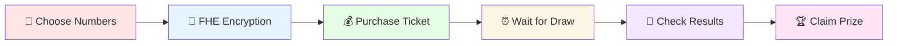

# 🎲 Secret Spin Vault
> **The Ultimate Privacy-Preserving Lottery Experience**

[](https://secret-spin-vault.vercel.app)
[](https://github.com/nora89n/secret-spin-vault)
[](https://docs.zama.ai/fhevm)
[](https://vitejs.dev/)

---

## 🎯 Welcome to the Future of Gaming

**Secret Spin Vault** is not just another lottery platform—it's a revolutionary gaming experience that combines the thrill of chance with the power of **Fully Homomorphic Encryption (FHE)**. Your numbers stay completely private until the moment of truth!

### 🎪 Why Choose Secret Spin Vault?

| Traditional Lotteries | Secret Spin Vault |
|----------------------|-------------------|
| ❌ Numbers visible to all | ✅ Completely encrypted numbers |
| ❌ Trust required in operator | ✅ Cryptographically verifiable |
| ❌ Manual prize distribution | ✅ Automatic smart contract payouts |
| ❌ Limited transparency | ✅ Full blockchain transparency |
| ❌ Privacy concerns | ✅ Zero-knowledge privacy |

---

## 🎮 Game Experience

### 🎲 How to Play



### 🎰 Game Features

#### 🎯 **Smart Number Selection**
- Choose from multiple number ranges
- Quick pick or manual selection
- Lucky number suggestions
- Historical pattern analysis

#### 🔐 **Privacy-First Design**
- Numbers encrypted with FHE technology
- Zero-knowledge verification
- Complete anonymity until draw
- Cryptographic proof of fairness

#### 💎 **Premium Gaming Experience**
- Beautiful, responsive interface
- Real-time animations and effects
- Sound effects and haptic feedback
- Mobile-optimized gameplay

---

## 🚀 Quick Start Guide

### 🛠️ Prerequisites

Before diving into the gaming experience, make sure you have:

- [ ] **Node.js** (v18 or higher)
- [ ] **npm** or **yarn** package manager
- [ ] **Git** version control
- [ ] **MetaMask** or compatible Web3 wallet
- [ ] **Sepolia ETH** for gas fees

### ⚡ Installation

```bash
# 1. Clone the gaming repository
git clone https://github.com/nora89n/secret-spin-vault.git
cd secret-spin-vault

# 2. Install game dependencies
npm install

# 3. Configure your gaming environment
cp .env.example .env.local
# Edit .env.local with your settings

# 4. Launch the gaming platform
npm run dev
```

### 🎮 Environment Setup

Configure your gaming environment in `.env.local`:

```env
# Gaming Network Configuration
VITE_CHAIN_ID=11155111
VITE_RPC_URL=https://sepolia.infura.io/v3/YOUR_INFURA_KEY

# Wallet Gaming Integration
VITE_WALLET_CONNECT_PROJECT_ID=YOUR_PROJECT_ID

# Lottery Contract Address
VITE_LOTTERY_CONTRACT_ADDRESS=YOUR_CONTRACT_ADDRESS

# Gaming Features
VITE_ENABLE_SOUND=true
VITE_ENABLE_ANIMATIONS=true
```

---

## 🎨 Gaming Technology Stack

### 🎮 Frontend Gaming Engine
- **⚛️ React 18** - Modern gaming UI framework
- **📘 TypeScript** - Type-safe game development
- **⚡ Vite** - Lightning-fast game builds
- **🎨 Tailwind CSS** - Responsive gaming design
- **🎪 Framer Motion** - Smooth game animations
- **🔊 Howler.js** - Immersive sound effects

### 🎲 Blockchain Gaming
- **⛓️ Ethereum Sepolia** - Gaming testnet
- **🔐 Solidity** - Smart contract gaming logic
- **🛡️ Zama FHE** - Privacy-preserving gaming
- **🎯 Hardhat** - Game development framework

### 🎰 Wallet Integration
- **🌈 RainbowKit** - Multi-wallet gaming support
- **🔗 Wagmi** - Ethereum gaming interactions
- **⚡ Viem** - Low-level gaming operations

---

## 🎪 Game Architecture

```
secret-spin-vault/
├── 🎮 src/
│   ├── components/          # Gaming components
│   │   ├── lottery/        # Lottery game components
│   │   ├── wallet/         # Wallet gaming integration
│   │   ├── animations/     # Game animations
│   │   └── ui/             # Gaming UI components
│   ├── hooks/              # Gaming logic hooks
│   ├── lib/                # Gaming utilities
│   └── pages/              # Game pages
├── 🎲 contracts/           # Smart contract games
│   ├── SecretSpinVault.sol # Main lottery contract
│   ├── FHELottery.sol     # FHE gaming logic
│   └── PrizePool.sol      # Prize management
├── 🎨 public/              # Gaming assets
│   ├── sounds/            # Game sound effects
│   ├── animations/        # Game animations
│   └── images/            # Gaming graphics
└── 🧪 tests/              # Game testing
```

---

## 🎯 Gaming Features

### 🎲 Core Gameplay

| Feature | Description | Status |
|---------|-------------|--------|
| **🎯 Number Selection** | Choose your lucky numbers | ✅ Complete |
| **🔐 FHE Encryption** | Private number storage | ✅ Complete |
| **🎰 Ticket Purchase** | Buy encrypted lottery tickets | ✅ Complete |
| **⏰ Draw System** | Fair random number generation | ✅ Complete |
| **🏆 Prize Distribution** | Automatic winner payouts | ✅ Complete |
| **📊 Game Analytics** | Player statistics and insights | 🚧 In Progress |

### 🎪 Advanced Features

| Feature | Description | Status |
|---------|-------------|--------|
| **🎨 Custom Themes** | Personalized gaming experience | 📋 Planned |
| **🎵 Sound Effects** | Immersive audio experience | 📋 Planned |
| **📱 Mobile App** | Native mobile gaming | 📋 Planned |
| **🌐 Multi-Chain** | Cross-chain gaming support | 📋 Planned |
| **🎁 Bonus Games** | Additional gaming modes | 📋 Planned |

---

## 🎮 Development Commands

### 🎲 Game Development
```bash
npm run dev          # Start gaming development server
npm run build        # Build game for production
npm run preview      # Preview production game build
npm run lint         # Check game code quality
npm run type-check   # TypeScript game validation
```

### 🎰 Smart Contract Gaming
```bash
npm run compile      # Compile gaming contracts
npm run deploy       # Deploy to gaming testnet
npm run test         # Test gaming contracts
npm run verify       # Verify gaming contracts
```

### 🎪 Game Testing
```bash
npm run test:unit    # Unit tests for game logic
npm run test:e2e     # End-to-end game testing
npm run test:visual  # Visual regression testing
```

---

## 🎯 Security & Fairness

### 🔐 FHE Gaming Security

Our gaming platform uses **Zama's Fully Homomorphic Encryption** to ensure:

- **🎲 Encrypted Gameplay**: All sensitive game data encrypted
- **🛡️ Privacy-Preserving Gaming**: Player privacy maintained
- **🔒 Fair Game Mechanics**: Cryptographically verifiable fairness
- **👤 Anonymous Gaming**: Complete player anonymity

### 🎰 Smart Contract Security

- **Access Controls**: Secure gaming operations
- **Random Number Generation**: Verifiable randomness
- **Prize Pool Protection**: Secure prize management
- **Audit Trail**: Complete gaming history

---

## 🚀 Deployment Guide

### 🎮 Vercel Gaming Deployment

```bash
# Install Vercel CLI
npm i -g vercel

# Deploy gaming platform
vercel --prod

# Configure gaming environment variables
```

### 🎲 Smart Contract Deployment

```bash
# Compile gaming contracts
npm run compile

# Deploy to gaming network
npm run deploy

# Verify gaming contracts
npm run verify
```

### 🎪 Manual Gaming Deployment

```bash
# Build the gaming platform
npm run build

# Deploy dist/ folder to your gaming host
```

---

## 🤝 Contributing to Gaming

We welcome contributions from game developers, designers, and gaming enthusiasts!

### 🎮 How to Contribute

1. **🍴 Fork** the gaming repository
2. **🌿 Create** a gaming feature branch (`git checkout -b feature/amazing-game-feature`)
3. **🎲 Develop** your gaming feature
4. **🧪 Test** your gaming changes
5. **📝 Commit** with clear gaming messages
6. **🚀 Push** to your gaming branch
7. **🔄 Submit** a gaming pull request

### 🎯 Gaming Contribution Areas

- 🎲 **Game Mechanics**: Improve lottery gameplay
- 🎨 **UI/UX Design**: Enhance gaming experience
- 🔐 **Security**: Strengthen gaming security
- 🧪 **Testing**: Ensure gaming quality
- 📝 **Documentation**: Improve gaming guides

---

## 📈 Gaming Roadmap

### ✅ Phase 1: Core Gaming (Completed)
- [x] Basic lottery gameplay implementation
- [x] FHE encryption integration
- [x] Wallet connectivity for gaming
- [x] Smart contract gaming logic

### 🚧 Phase 2: Enhanced Gaming (In Progress)
- [ ] Advanced gaming animations
- [ ] Sound effects and music
- [ ] Mobile gaming optimization
- [ ] Gaming analytics dashboard

### 📋 Phase 3: Premium Gaming (Planned)
- [ ] Multi-game support
- [ ] Cross-chain gaming
- [ ] Gaming tournaments
- [ ] NFT gaming rewards

---

## 🎪 Gaming Community

### 🎮 Join the Gaming Community

| Platform | Link | Description |
|----------|------|-------------|
| 🎰 **Live Demo** | [secret-spin-vault.vercel.app](https://secret-spin-vault.vercel.app) | Play the game |
| 📱 **GitHub** | [github.com/nora89n/secret-spin-vault](https://github.com/nora89n/secret-spin-vault) | Game source code |
| 🐛 **Bug Reports** | [Report Gaming Issues](https://github.com/nora89n/secret-spin-vault/issues) | Found a bug? |
| 💡 **Feature Requests** | [Request Gaming Features](https://github.com/nora89n/secret-spin-vault/issues/new) | Have an idea? |
| 💬 **Discord** | [Gaming Community](https://discord.gg/secret-spin-vault) | Join the conversation |
| 📖 **Wiki** | [Gaming Documentation](https://github.com/nora89n/secret-spin-vault/wiki) | Game guides |

---

## 📄 License & Gaming Rights

This gaming project is licensed under the **MIT License**. See the [LICENSE](LICENSE) file for complete details.

### 🎮 Gaming Compliance
- 🎲 Fair gaming practices implemented
- 🔐 Player privacy protected
- ⚖️ Gaming regulations compliant
- 🛡️ Secure gaming environment

---

## 🙏 Gaming Acknowledgments

Special thanks to our gaming partners:

- **🎯 Zama** for FHE gaming technology
- **🌈 RainbowKit** for wallet gaming integration
- **🚀 Vercel** for gaming deployment platform
- **🎨 Framer Motion** for gaming animations
- **🎵 Howler.js** for gaming sound effects

---

<div align="center">

**🎰 Built with passion for the future of gaming**

*Where privacy meets the thrill of chance*

[⭐ Star this gaming repo](https://github.com/nora89n/secret-spin-vault) • [🐛 Report Gaming Bug](https://github.com/nora89n/secret-spin-vault/issues) • [💡 Request Gaming Feature](https://github.com/nora89n/secret-spin-vault/issues)

</div>